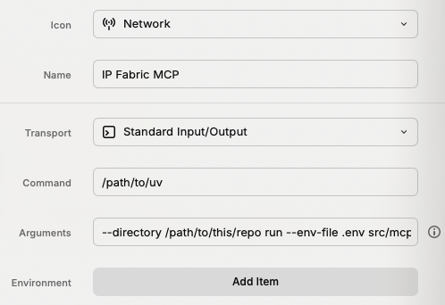

# MCP server for IP Fabric

MCP server to interact with IP Fabric via the python SDK, initially inspired by the [MCP Server](https://github.com/MarkusPfundstein/mcp-obsidian) for Obsidian.

<a href="https://ipfabric.io"></a>

## Components

### Tools

The server implements multiple tools to interact with IP Fabric:

- **ipf_get_filter_help**: Provides help information for using filters in queries
- **ipf_get_snapshots**: Lists all available snapshots in IP Fabric
- **ipf_set_snapshot**: Sets the active snapshot for subsequent queries
- **ipf_get_devices**: Gets device inventory data with optional filters
- **ipf_get_interfaces**: Gets interface inventory data with optional filters
- **ipf_get_hosts**: Gets host inventory data with optional filters
- **ipf_get_sites**: Gets site inventory data with optional filters
- **ipf_get_vendors**: Gets vendor inventory data with optional filters
- **ipf_get_routing_table**: Gets routing table data with optional filters
- **ipf_get_managed_ipv4**: Gets managed IPv4 data with optional filters
- **ipf_get_arp**: Gets ARP data with optional filters
- **ipf_get_mac**: Gets MAC address data with optional filters
- **ipf_get_vlans**: Gets VLAN data with optional filters
- **ipf_get_neighbors**: Gets neighbor discovery data with optional filters
- **ipf_get_available_columns**: Gets available columns for specific table types
- **ipf_get_connection_info**: Gets IP Fabric connection information and status
- **ipf_compare_table**: Compares one table between two snapshots

### Example prompts

It's good to first instruct Claude to use IP Fabric. Then it will always call the tools.

Use prompts like this:

- "Show me all available snapshots in IP Fabric"
- "Set the snapshot to the latest one and show me all devices"
- "Get all Cisco devices from the inventory"
- "Show me all interfaces on router 'core-01'"
- "Find all routes to 192.168.1.0/24"
- "Get devices with hostname containing 'switch'"
- "Show me the routing table for devices in site 'headquarters'"
- "What columns are available for the devices table?"

## Configuration

### Environment Variables

The server uses environment variables for configuration. Copy the `.env.sample` file to `.env` and update the values accordingly:

```bash
cp .env.sample .env
```

#### Required Environment Variables

##### IP Fabric Configuration

```bash
# IP Fabric Configuration
IPF_URL=https://ipfabric-server.domain
IPF_TOKEN=your_api_token_here
```

##### AI Model Configuration

Choose one of the following AI providers and set the `AI_MODEL` and `AI_API_KEY` variables accordingly.

Here are some examples:

```bash
# OpenAI (default)
AI_MODEL="gpt-4o"
AI_API_KEY=sk-proj-xxx

# Anthropic
AI_MODEL="anthropic/claude-sonnet-4-0"
AI_API_KEY=sk-ant-api...

# Google Gemini
AI_MODEL="gemini/gemini-2.5-flash"
AI_API_KEY=xxx
```

#### Optional Environment Variables

##### LangSmith Tracing (Optional)

```bash
# Enable tracing with LangSmith
LANGSMITH_TRACING=true
LANGSMITH_ENDPOINT="https://eu.api.smith.langchain.com"
LANGCHAIN_API_KEY=lsv2_xx_123..._123...
LANGSMITH_PROJECT="ipf-mcp-2025-07"
```

### Configuration Methods

1. **Add to server config (preferred)**

    ```json
    {
      "mcp-ipf": {
        "command": "/path/to/uv",
        "args": [
          "--directory",
          "<path_to_this_repo>",
          "run",
          "--env-file",
          ".env",
          "src/mcp_ipf/server.py"
        ],
        "env": {
          "IPF_TOKEN": "<your_api_token_here>",
          "IPF_URL": "<your_ip_fabric_host>",
          "AI_MODEL": "<your_ai_model>",
          "AI_API_KEY": "<your_ai_api_key>"
        }
      }
    }
    ```

    Sometimes Claude has issues detecting the location of uv / uvx. You can use `which uvx` to find and paste the full path in above config in such cases.

2. **Use `.env` file** in the working directory with the required variables (copy from `.env.sample`):

    ```bash
    cp .env.sample .env
    # Edit .env with your actual values
    ```

## Quickstart

### Prerequisites

#### IP Fabric API Access

You need IP Fabric API access with a valid API token. Get this from your IP Fabric instance:

1. Log into your IP Fabric instance
2. Go to Settings → API tokens
3. Create a new API token
4. Copy the token for use in configuration

#### Claude Desktop

On MacOS: `~/Library/Application\ Support/Claude/claude_desktop_config.json`

!!! note
    it's recommended to use the full path to `uv` in the configuration, as sometimes Claude has issues detecting the location of `uv`.
    Use `which uv` to find the full path and paste it in the `command` field of the configuration.

<details>
  <summary>Development/Unpublished Servers Configuration</summary>

  ```json
    {
      "mcpServers": {
        "mcp-ipf": {
          "command": "/path/to/uv",
          "args": [
            "--directory",
            "<path_to_this_repo>",
            "run",
            "--env-file",
            ".env",
            "src/mcp_ipf/server.py"
          ],
          "env": {
            "IPF_TOKEN": "<your_api_token_here>",
            "IPF_URL": "<your_ip_fabric_host>"
          }
        }
      }
    }
  ```

</details>

#### Raycast AI - MCP Servers

1. Open Raycast, type `mcp` and select `Install Server`

    

2. Fill the form with the following details:

    - command: `/path/to/uv`

      If unsure, use `which uv` to find the full path.

    - arguments: `--directory <path_to_this_repo> run --env-file .env src/mcp_ipf/server.py`

    

3. Now you can install the server with `⌘` + `⏎`

### Using the CLI

To use the CLI application, after setting up your environment variables:

```bash
uv run python cli_app.py
```

### Using Streamlit

...**coming soon**...

## Development

### Project Structure

```tree
playground-mcp-ipf/
├── src/
│   └── mcp_ipf/
│       ├── __init__.py      # Package entry point
│       ├── server.py        # MCP server implementation
│       ├── tools.py         # Tool handlers
├── .env                      # Environment variables (copy from .env.sample)
├── .env.sample              # Sample environment variables
├── cli_app.py               # CLI application using the MCP server
├── pyproject.toml
└── README.md
```

### Running

Run the server directly during development:

```bash
uv run mcp-ipf
```

### Adding New Tools

To add new IP Fabric tools:

1. Create a new tool handler class in `tools.py`
2. Add the tool class to the `tool_classes` list in `server.py`
3. The tool will be automatically registered and available

## Supported AI Models

The server supports multiple AI providers through LiteLLM:

- **OpenAI**: `gpt-4o`, `gpt-4o-mini`, `gpt-3.5-turbo`, etc.
- **Anthropic**: `anthropic/claude-sonnet-4-0`, `anthropic/claude-haiku-3-5`, etc.
- **Google Gemini**: `gemini/gemini-2.5-flash`, `gemini/gemini-pro`, etc.

See the respective provider documentation for full model lists:

- [OpenAI models](https://docs.litellm.ai/docs/providers/openai#openai-chat-completion-models)
- [Anthropic models](https://docs.anthropic.com/en/docs/about-claude/models/overview#model-aliases)
- [Google Gemini models](https://ai.google.dev/gemini-api/docs/models)

## Troubleshooting

### Common Issues

1. **Connection errors**: Verify your `IPF_URL` and `IPF_TOKEN` are correct
2. **SSL certificate issues**: Check your IP Fabric server's SSL configuration
3. **Permission errors**: Ensure your API token has sufficient permissions in IP Fabric
4. **Snapshot issues**: Use `ipf_get_snapshots` to see available snapshots, then `ipf_set_snapshot` to select one
5. **Environment variable issues**: Ensure your `.env` file is properly configured and accessible

### Getting Help

- Check the server logs: `tail -f ~/Library/Logs/Claude/mcp-server-mcp-ipf.log`
- Use the MCP Inspector for debugging
- Verify your IP Fabric API token has the necessary permissions
- Ensure your IP Fabric instance is accessible from your machine
